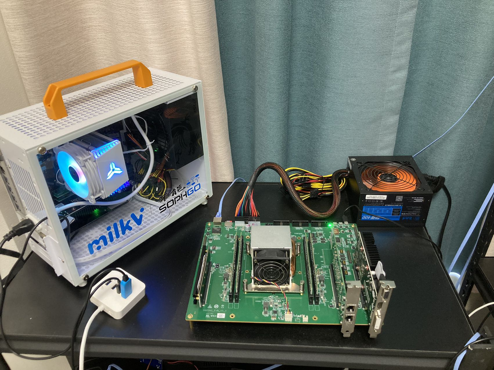

# SG2042 Newsletter (2023-08-04 #002)

## Editor's Note

Welcome to the second issue of the SG2042 Newsletter. This week we saw more cases of SG2042 applications. Communities including openEuler are using the powerful computing power of SG2042 to improve productivity. Another small and interesting product (milkv Duo) has also received a lot of updates.

## Highlights

+ The openEuler RISC-V SIG has connected the SG2042 (EVB) server board to the OERV OBS (Open Build Service) for system build testing since April 2023, and it has been basically running stably for many months, and has provided a 6-30 times build acceleration for various large package builds. With the release of Milk-V Pioneer, more and more high-performance RISC-V devices based on SG2042 will join the OERV build farm, aiming to provide RISC-V package build acceleration for various systems including openEuler, Debian, Deepin, and so on.

  [Trial address](https://build.tarsier-infra.com/) & [Related news](https://www.techgoing.com/openeuler-successfully-adapts-sg2042-server-board-to-accelerate-package-builds/)
  
  

+ “Hello RISC-V world!” blog has been released! PerfXLab has developed a blog based on the RISC-V server, which is dedicated to recording the bits and pieces of growth in the field of RISC-V servers. The URL is provided below, contributions are welcome!

  http://blog.rvv.top:8002

## Upstream

Most of the code is already open-source and can be obtained from repositories such as github.com/SOPHGO. The following are some useful repo resources:

### Linux kernel

https://github.com/sophgo/linux-riscv

+ txgbe driver supports wangxun 10GbE cards
+ SG2042 soc multiple drivers merge-in
+ Normal bugs fixing
+ Device tree configuration 
+ Kernel defconfig configuration 

### U-Boot

https://github.com/sophgo/u-boot/tree/sg2042-dev

+ CONFIG_NET_RANDOM_ETHADDR removed from defconfig  

### OpenSBI

https://github.com/sophgo/opensbi/tree/sg2042-dev

+ No submissions this week

## Case Study

We're looking for fun, good, or profitable use cases for SG2042. Feel free to share your experiences with us - [just send a PR!](https://github.com/sophgocommunity/SG2042-Newsletter)

## Events and Games

+ RISC-V Public Beta Platform · Contest selections are being prepared and the prizes are ready! If you are interested, please see  http://www.perfxlab.com or check it out in the Wechat Official Account.

## In the News
+ Milk-V Duo Free Trial - Network Connection

  https://bbs.elecfans.com/jishu_2367159_1_1.html 

+ Milk-V Duo Free Trial - Windows Development Environment Setup

  https://bbs.elecfans.com/jishu_2366654_1_1.html 

+ Milk-V Duo Free Trial - Hardware and Software Resources & System boot & Hardware Circuit Analysis 

  https://bbs.elecfans.com/jishu_2366514_1_1.html 

+ Milk-V Duo Free Trial - OpenCV Cross-compiling

  https://bbs.elecfans.com/jishu_2366639_1_1.html 

+ Milk-V Duo Free Trial - Flashing System Image

  https://bbs.elecfans.com/jishu_2366644_1_1.html 

+ The first wave of Milk-V Duo trial reports has been released. The summary link is below

  https://bbs.elecfans.com/try_CV1800B.html

+ Sophgo's Forum is now online.

  https://forum.sophgo.com/
  
+ RISC-V Public Beta Platform Released · How to Run K3s on SG2042

  http://blog.rvv.top:8002/risc-v-public-beta-platform-released-how-to-run-k3s-on-sg2042.html#risc-v-public-beta-platform-released-how-to-run-k3s-on-sg2042
### News from Japanese, Korean, Russian and other language communities.

Not ready yet. We are recruiting multilingual volunteers and interns. Welcome to join us! Please email [Wei Wu](mailto:wuwei2016@iscas.ac.cn) if you are interested in being an open source community intern.

