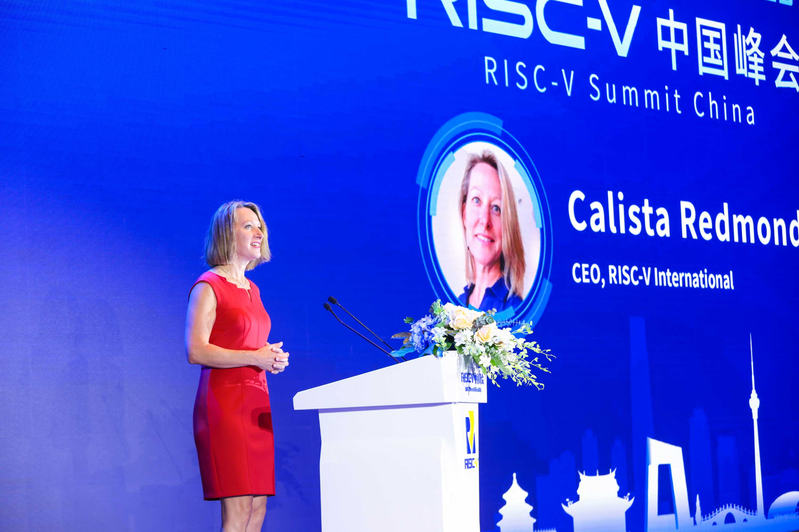
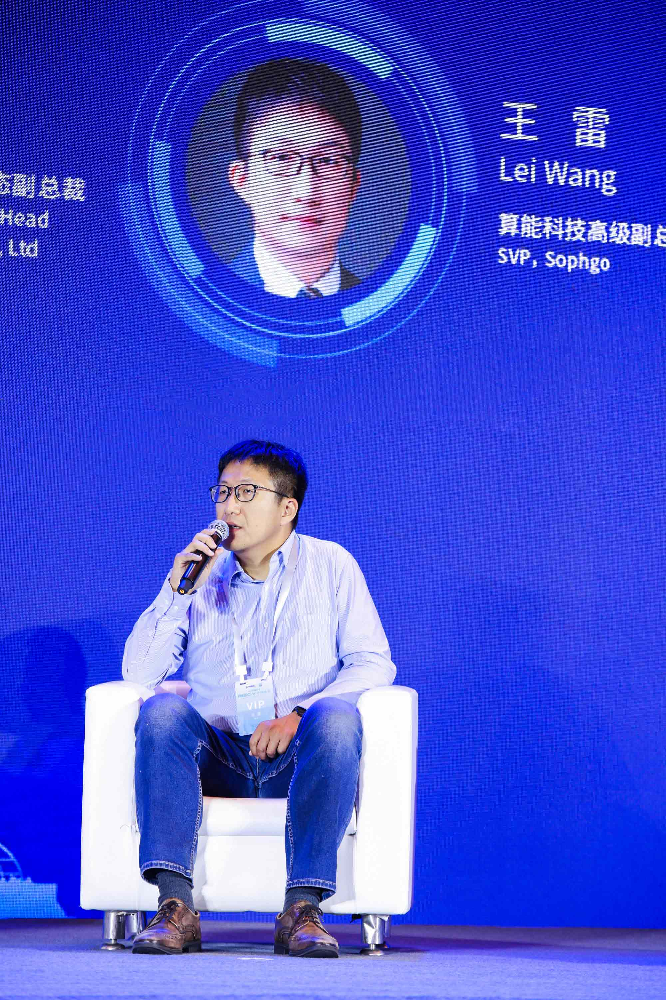
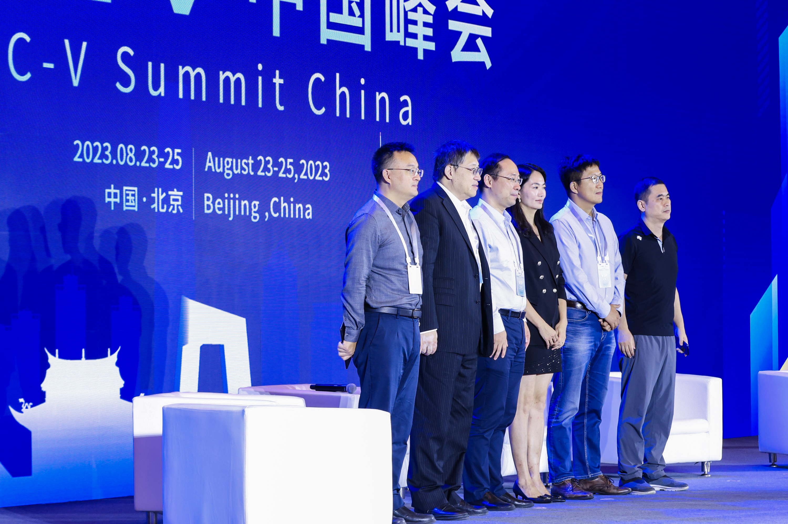
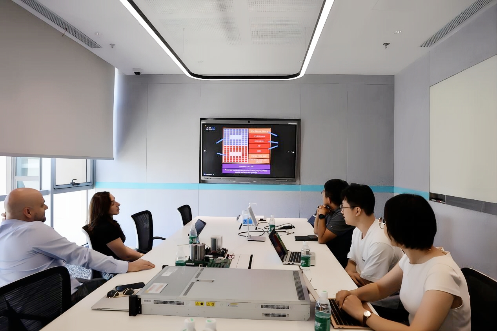
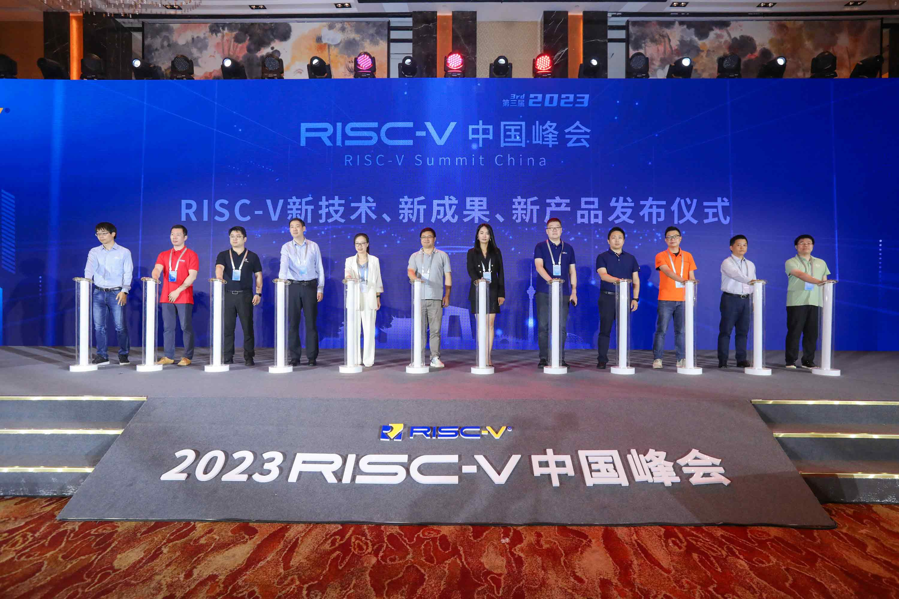
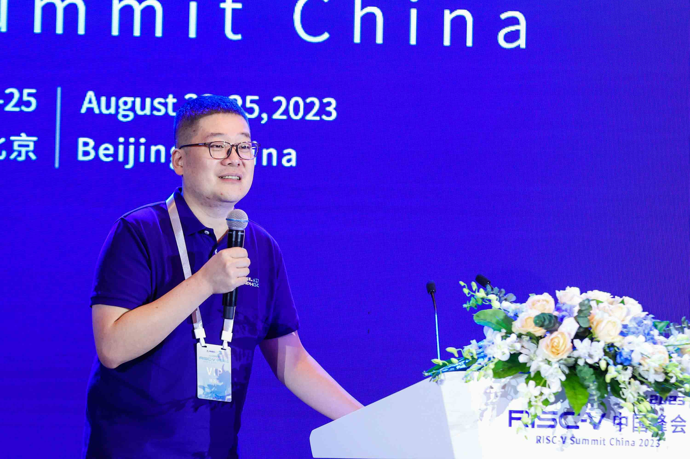
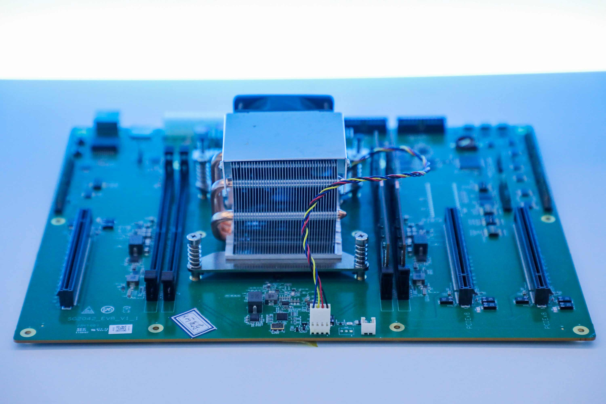
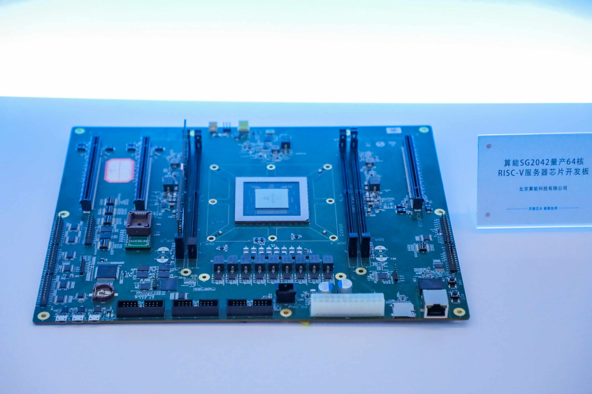
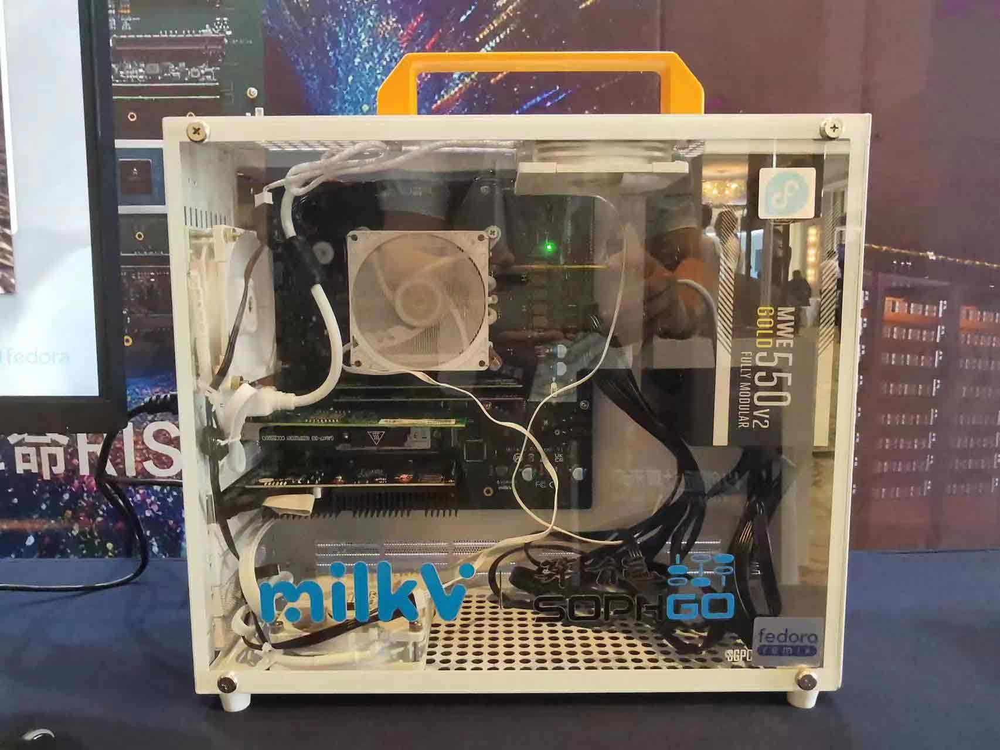
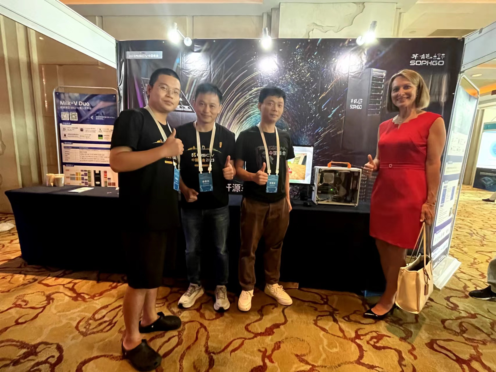

# SG2042 Newsletter (2023-08-25 #005)

## Editor's Note

Welcome to the fifth issue of the SG2042 Newsletter and thank you for your continued interest and support. In this issue, we focus on exploring the cutting edge of technology innovation and bring you a series of exciting content about the RISC-V Summit China 2023.

## Highlights

+ On August 23, 2023, RISC-V Summit China was grandly opened at Shangri-La Hotel in Beijing! Calista Redmond, CEO of RISC-V International, delivered the opening keynote speech, and Lei Wang, Senior Vice President of SOPHGO, brought a wonderful talk and sharing session for all the attendees.

  

  

  

  

  

  

+ On August 22, 2023, Philipp Tomsich, the Chairman of the RISC-V International Software Committee, and his delegation visited SOPHGO for guidance and exchange. They were received by Lei Wang,  Senior Vice President of SOPHGO. Both sides had in-depth discussions on cutting-edge technologies and applications in the field of AI and RISC-V.

  

  

  

  

  [Related news](https://mp.weixin.qq.com/s/LZsFuGoFvjYnRGR6EJcVQQ)

+ On behalf of SOPHGO, Jinian Lu, Director of RISC-V Product Line, participated in the 2023 RISC-V Summit China and delivered a speech on "RISC-V, the Open Source Revolution that Disrupts Traditional Hardware Products".

  

  

  

  

+ SG2042 (EVB) Server Board, SG2042 Development Board and Milk-V Pioneer Box are on display during the RISC-V Summit China.  

  

  

  

  

  

  

  

  

+ SOPHGO showcased the industry's first RISC-V fusion server cluster at the summit.

  [Related news](https://mp.weixin.qq.com/s/5UHFtOc9deXkvMnK_sOFdA)

## Upstream

Most of the code is already open-source and can be obtained from repositories such as github.com/SOPHGO. The following are some useful repo resources:

### Linux kernel

https://github.com/sophgo/linux-riscv

+ PCIe driver optimized

### U-Boot

https://github.com/sophgo/u-boot/tree/sg2042-dev

+ No commits this week

### OpenSBI

https://github.com/sophgo/opensbi/tree/sg2042-dev

+ No commits this week

## Case Study

We're looking for fun, good, or profitable use cases for SG2042. Feel free to share your experiences with us - [just send a PR!](https://github.com/sophgocommunity/SG2042-Newsletter/pulls)

## Events and Games

+ [The 18th China Graduate Student Electronic Design Competition - SOPHGO Cup Winners Announcement](https://mp.weixin.qq.com/s/ME9hBnEwBgzelMRwOJSZHg)

## In the News

+ [A delegation consisting of experts from the Rail Transit Vision Security Alliance visited SOPHGO for guidance and exchange](https://mp.weixin.qq.com/s/ZJEctkhSof8-O7ohliiWeQ)
+ [SOPHGO made the RISC-V converged sever world debut and delivered a speech in the 2023 China Computational Conference](https://mp.weixin.qq.com/s/bXhz78U9cgsYmq_GEjcqcg)
+ [SG2042 Software Support](https://forum.sophgo.com/t/topic/97)
+ [Milk-V Duo Tutorials](https://forum.sophgo.com/t/duo-tutorials-by-spotpear/152)
+ [RVV benchmark Milk-V Pioneer (SG2042, C920)](http://blog.rvv.top:8002/rvv-benchmark-milk-v-pioneer-sg2042-c920.html#rvv-benchmark-milk-v-pioneer-sg2042-c920)
+ [Summary of CV181x/CV180x AliOS SD development documents](https://forum.sophgo.com/t/cv181x-cv180x-alios-sdk/186)
+ [Milk-V Duo Free Trial - Car movements control on Linux](https://bbs.elecfans.com/jishu_2371138_1_1.html)
+ [Milk-V Duo Free Trial - Controlling Propeller Circuitry on Linux](https://bbs.elecfans.com/jishu_2371054_1_1.html)
+ [Milk-V Duo Free Trial - Running Golang Programs on Duo](https://forum.sophgo.com/t/milk-v-duo-1-duo-golang/196)
+ [Milk-V Duo Free Trial - Building Python environment based on AliCloud hosting](https://bbs.elecfans.com/jishu_2370813_1_1.html)
+ [Milk-V Duo's trial report continues to deliver. Click to see summary links](https://bbs.elecfans.com/try_CV1800B.html)
+ [RISC-V Public Beta Platform Released · Configuring Jupiter and Octave Scientific Computing Environment on SG2042](https://mp.weixin.qq.com/s/-gpB7do7sHqgsbqpgogxwQ)

### News from Japanese, Korean, Russian and other language communities.

Not ready yet. We are recruiting multilingual volunteers and interns. Welcome to join us! Please email [Wei Wu](mailto:wuwei2016@iscas.ac.cn) if you are interested in being an open source community intern.
