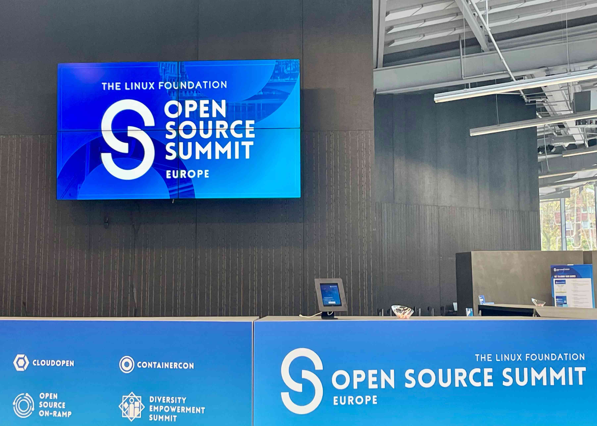
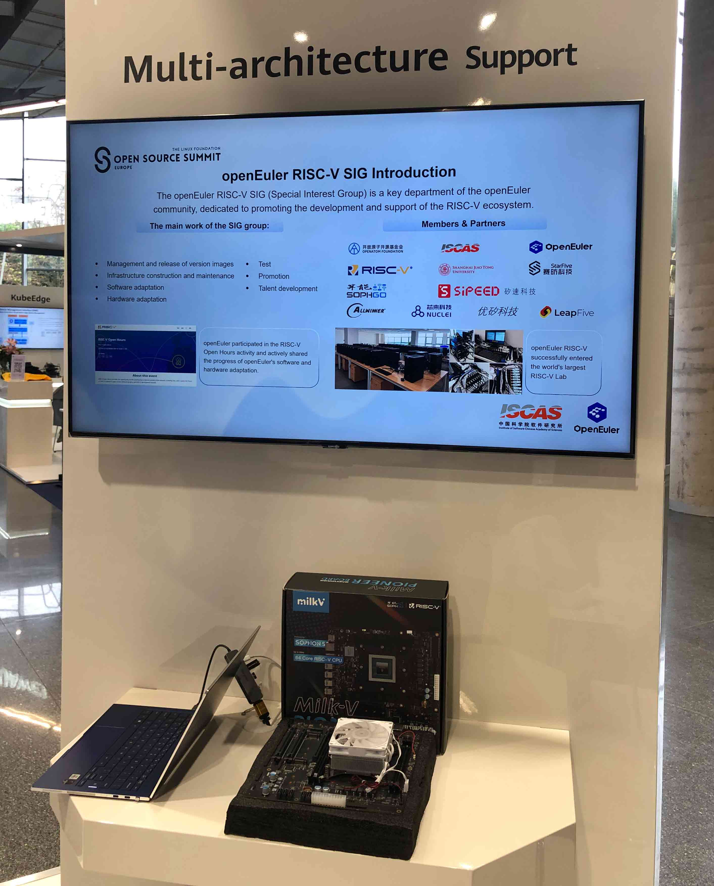
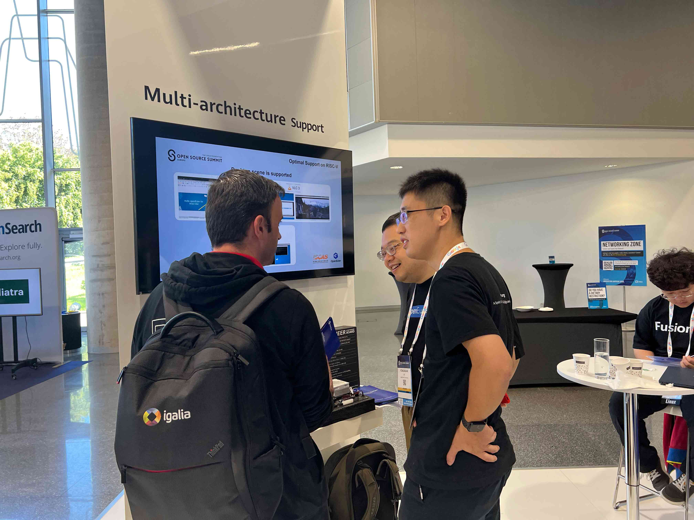

# SG2042 Newsletter (2023-09-22 #009)

## 卷首语

欢迎来到第九期 SG2042 Newsletter。本期特别感谢山东大学智能创新研究院的戴鸿君老师和山东大学的同学们对开源社区的大力支持，做了许多与 SG2042 相关的研究！同时，我们也要衷心感谢那些默默奉献的贡献者们，正是因为你们的无私付出和坚持，我们才能够持续地提供有价值的内容给大家，使得开源社区能够持续、稳定地发展。在本期周刊中，我们还有令人振奋的消息要与大家分享！Milk-V Pioneer Board 在 2023 欧洲开源峰会上成功亮相！

## 本期亮点

+ 来自山东大学智能创新研究院的戴鸿君老师和同学们在 SG2042 服务器上进行开源数据库的部署和应用测试工作，他们的努力为我们提供了宝贵的数据和反馈，对于 SG2042 的优化和改进具有重要意义。

  [相关新闻](https://forum.sophgo.com/t/sg2042/282)

+ 2023 年 9 月 19 日，开源欧洲峰会在西班牙毕尔巴鄂盛大举行！Milk-V Pioneer Board 在峰会上展出，并吸引了海外开发者的关注。与此同时，海外开源人士对于 RISC-V 架构的硬件表现出了极大的兴趣，并对其发展速度感到惊讶。

  

  

  

  

  

## 上游

大部分代码已经开源，可以从 github.com/SOPHGO 等资源库中获取。以下是一些常用的软件仓库资源：

### Linux kernel

- 算能社区工作：https://github.com/sophgo/linux-riscv

  -  设备树代码结构优化

- Linux 官方社区上游工作:

  - [[PATCH v2 00/11] Add Milk-V Pioneer RISC-V board support](https://lore.kernel.org/linux-riscv/cover.1695189879.git.wangchen20@iscas.ac.cn/)

### U-Boot

https://github.com/sophgo/u-boot/tree/sg2042-dev

+ 本周无提交

### OpenSBI

https://github.com/sophgo/opensbi/tree/sg2042-dev 

+ 本周无提交

## 案例研究

我们正在为 SG2042 寻找有趣且有益的使用案例，欢迎经验分享并[提交](https://github.com/sophgocommunity/SG2042-Newsletter/pulls)！

## 活动竞赛

+ [算力中国行·长沙站｜活动圆满收官，大模型智算盒Airbox重磅发布！](https://mp.weixin.qq.com/s/RETR5DQmNhd-OZHZ0Ag-6g)

## 相关新闻

+ [Milk-V Duo 测试通过VLC显示CAM-GC2083摄像头拍摄画面](https://b23.tv/4bSgJ92)
+ [【Milk-V Duo】 duo简介和基本开发环境搭建](https://b23.tv/5gx1sC6)
+ [DDE v23在Arch Linux RISC-V上的首秀](https://twitter.com/felixonmars/status/1704943664366244276)
+ [Milk-V Duo加载六轴传感器MPU6050](https://community.milkv.io/t/i2c-milk-v-duo-mpu6050/626)
+ [Milk-V Duo点亮ST7735](https://community.milkv.io/t/spi-milk-v-duo-st7735/625/1)
+ [来自 nihui 的 Milk-V Duo测试报告](https://github.com/nihui/milkv-duo-test)
+ [Milk-V Duo原厂Linux_SDK编译流程](https://zhuanlan.zhihu.com/p/657030662)
+ [Milk-V Duo RT-Smart 编译运行](https://zhuanlan.zhihu.com/p/657033587)
+ [RISC-V公测平台发布:在SG2042上玩转Caddy](https://mp.weixin.qq.com/s/qe9lVK_viErCEDsHNRKSdQ)
+ [如何在RISC-V平台编译Paddle](https://zhuanlan.zhihu.com/p/655278471)
+ [如何在RISC-V平台编译PyTorch](https://zhuanlan.zhihu.com/p/655277146)
+ [RISC-V服务器（SG2042）尝试部署MongoDB、TiDB、Hbase、OracleDB](https://zhuanlan.zhihu.com/p/655276238)
+ [RISC-V服务器（SG2042）部署PostgreSQL](https://zhuanlan.zhihu.com/p/655269828)
+ [RISC-V服务器（SG2042）部署Redis](https://zhuanlan.zhihu.com/p/655268242)
+ [RISC-V服务器（SG2042）上部署开源数据库](https://zhuanlan.zhihu.com/p/655077069)
+ [RISC-V服务器（SG2042）部署MariaDB](https://zhuanlan.zhihu.com/p/655261937)
+ [RISC-V服务器（SG2042）部署MySQL](https://zhuanlan.zhihu.com/p/655254888)
+ [RISC-V服务器(SG2042)数据库性能测试](https://zhuanlan.zhihu.com/p/656961169)

### 日语、韩语和其他语言社区新闻

暂无。我们正在招募多语种志愿者和实习生，欢迎加入我们！如果您有兴趣成为一名开源社区实习生，请投递简历至：吴老师 [wuwei2016@iscas.ac.cn](mailto:wuwei2016@iscas.ac.cn) 。
