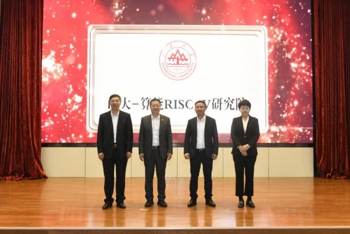
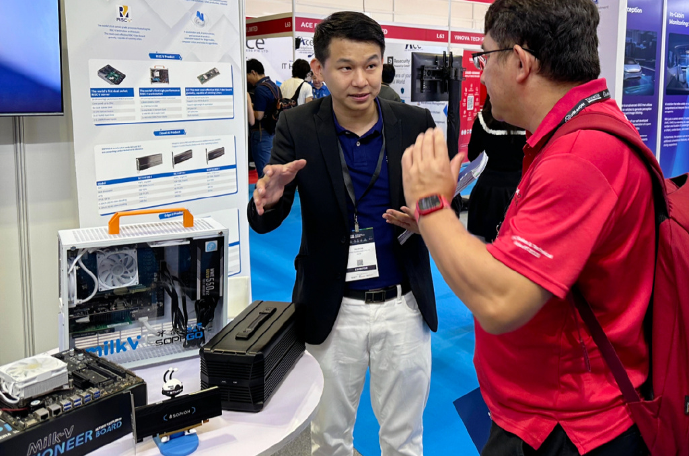
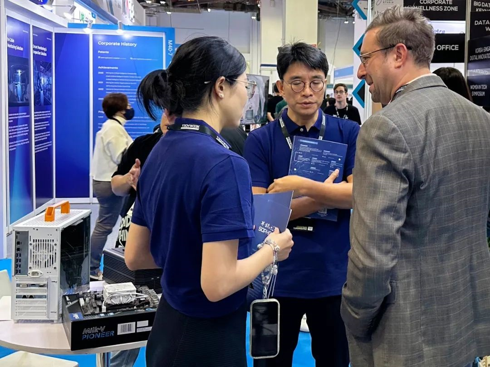
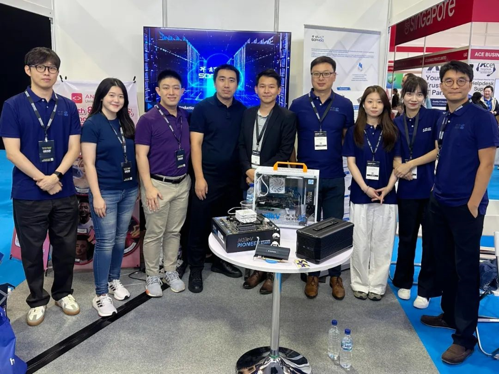

# SG2042 Newsletter (2023-10-20 #013)

## Editor's Note

Welcome to the thirteenth issue of the SG2042 Newsletter. We are thrilled to announce that the Shandong University-SOPHGO RISC-V Research Institute has been officially established. This is an important milestone that will greatly facilitate the promotion and application of RISC-V processors in China and provide strong technical support for industry development.

## Highlights

+ On October 13, 2023, the Shandong University-SOPHGO RISC-V Research Institute was officially announced, which is the first research institute in Chinese universities with RISC-V as its main research direction. The establishment of Shandong University-SOPHGO RISC-V Research Institute is not only a vibrant practice of combining industry, academia and research, but also demonstrates foresight, strategic significance and exemplar.

  RISC-V, as an open-source instruction set architecture, has received increasing attention and application in recent years. It has the advantages of flexibility, customizability and openness, bringing more opportunities for chip design and embedded systems. The collaboration between Shandong University and SOPHGO will promote in-depth research and wide application of RISC-V technology in China, providing new opportunities for the development of related fields.

  

  

  [Related news](https://mp.weixin.qq.com/s/0_2N6WI_Z2NRJ09joynn-w)

+ On October 11-12, 2023, the 5th Big Data & AI World event was held at Marina Bay Sands in Singapore. SOPHGO was invited to appear at the show to demonstrate the technical strength of China's AI computing power, which attracted the attention of attendees from all over the world.

  

  

  

  

  

  

  [Related news](https://weibo.com/ttarticle/p/show?id=2309404956447401443408)
  
+ Milk-V Duo has released the 1.0.5 firmware version. In this firmware update, generic freeRTOS codes for the second core (the little one) have been released. For details, please refer to the link below.

  [Detailed Info](https://github.com/milkv-duo/duo-buildroot-sdk/releases/tag/Duo-V1.0.5)  

## Upstream

Most of the code is already open-source and can be obtained from repositories such as github.com/SOPHGO. The following are some useful repo resources:

### Linux kernel

+ Sophgo Community work: https://github.com/sophgo/linux-riscv

  + Fix a bug in memblock
  + Feature enhancement
  + Routine bug fixes

+ Linux Official Community Upstream work:

  + Preliminary kernel support for Milk-V Pioneer/SG2042 has been [submitted to the SOC repository by kernel maintainer Conor][lk-1]. It is expected to enter the mainline after the merge window of version 6.7 is opened (about two to three weeks later) .

[lk-1]:https://lore.kernel.org/linux-riscv/20231016-filing-payroll-7aca51b8f1a3@spud/

### U-Boot

https://github.com/sophgo/u-boot/tree/sg2042-dev

+ No commits this week

### OpenSBI

+ Sophgo Community work: https://github.com/sophgo/opensbi/tree/sg2042-dev

  + No commits this week

+ OpenSBI Official Community Upstream work:

  The following patches have recently been submitted to upstream:

  + [lib: sbi: Add sub-regions check for sanitizing domain][sbi-1]
  + [platform: generic: thead: improve tlb flush errata][sbi-2]
  + [lib: utils/fdt: Allow zero length mtime when parsing ACLINT][sbi-3]
  + [lib: utils: Add T-HEAD C900 ACLINT][sbi-4]
  + [platform: generic: Add Sophgo sg2042 platform support][sbi-5]

[sbi-1]:https://lists.infradead.org/pipermail/opensbi/2023-October/005705.html
[sbi-2]:https://lists.infradead.org/pipermail/opensbi/2023-October/005712.html
[sbi-3]:https://lists.infradead.org/pipermail/opensbi/2023-October/005718.html
[sbi-4]:https://lists.infradead.org/pipermail/opensbi/2023-October/005736.html
[sbi-5]:https://lists.infradead.org/pipermail/opensbi/2023-October/005725.html

## Case Study

We're looking for fun, good, or profitable use cases for SG2042. Feel free to share your experiences with us - [just send a PR!](https://github.com/sophgocommunity/SG2042-Newsletter/pulls)

## Events and Games

+ Although there are no specific activities planned this week, we encourage you to explore our previous editions and engage with us through our social media channels.

## In the News

+ [How to wire an Ethernet cable for the Milk-V Duo][news-1]
+ [Simple SSD1306 Driver Coming Along][news-2]
+ [Milk-V Duo RISC-V computer USB input ST7789 240x240 SPI Display][news-3]
+ [RISC-V Vector Acceleration Experiment - memcpy][news-4]

[news-1]:https://community.milkv.io/t/milkv-duo-rj45-iperf3-100mbs/712/1
[news-2]:https://community.milkv.io/t/simple-ssd1306-driver-coming-along/726
[news-3]:https://www.youtube.com/watch?v=Swo-zJ6brQI
[news-4]:https://mp.weixin.qq.com/s/wDKbV6n_4kpUVP8c3ozUJg

### News from Japanese, Korean and other language communities

Not ready yet. We are recruiting multilingual volunteers and interns. Welcome to join us! Please email [Wei Wu](mailto:wuwei2016@iscas.ac.cn) if you are interested in being an open source community intern.
