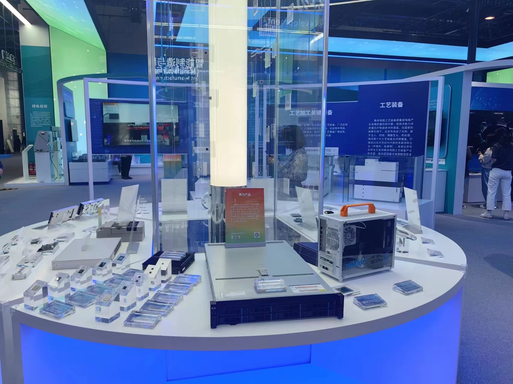

# SG2042 Newsletter (2024-05-03 #040)

## 卷首语

欢迎来到第四十期 SG2042 Newsletter。本期为大家带来了新的好消息：ThreadX RTOS 已移植到 riscv64 架构，目前可以在 Milk-V Duo 上运行！

## 本期亮点

+ ThreadX RISC-V 移植完成，可以跑在 Milk-V Duo 上了！ThreadX 运行于无 MMU 的小核 C906L 上，Linux 运行于大核 C906B 上。

  [相关新闻](https://mp.weixin.qq.com/s/8W31zlLTmPgxwhRJN73L4g)

+ 2024 年 4 月 25 日-29 日，以“创新：建设更加美好的世界”为主题的 2024 中关村论坛年会在北京中关村国际创新中心举办。本次论坛中，算能展台展示了旗下最新产品行业首款服务器级处理器 SG2042、高集成边缘 TPU 处理器 BM1688、高集成深度学习视觉处理器 CV186AH 及云边端全系列产品、生态联合产品。

  [相关新闻](https://mp.weixin.qq.com/s/PrEqrOWMSUiwyeXWB0yhvg)
  
  
  
+ 又一系统适配！NuttX RTOS on Duo S!

  [相关新闻](https://mp.weixin.qq.com/s/fhxSj4zGQsfnXsmI4v_ORA)

## 上游

大部分代码已经开源，可以从 github.com/SOPHGO 等资源库中获取。以下是一些常用的软件仓库资源：

### Linux kernel

+ 算能社区工作：https://github.com/sophgo/linux-riscv

  +  本周无提交

+ Linux 官方社区上游工作:

  + 本周暂无更新

### U-Boot

https://github.com/sophgo/u-boot/tree/sg2042-dev

+ 本周无提交

### OpenSBI

https://github.com/sophgo/opensbi/tree/sg2042-dev 

+ 本周无提交

## 案例研究

我们正在为 SG2042 寻找有趣且有益的使用案例，欢迎经验分享并[提交](https://github.com/sophgocommunity/SG2042-Newsletter/pulls)！

## 活动竞赛

+ 本周暂无。欢迎您浏览我们以前的版本，并通过我们的社交媒体渠道与我们互动。

## 相关新闻

+ [【Milk-V Duo】在Duo 上运行ThreadX|视频教程 - Part 1][news-1]
+ [Milk-V Duo i2c测试oled及波形输出][news-2]
+ [Milk-V Duo 测试pwm及波形输出][news-3]
+ [通过TFTP启动Milk-V Duo S][news-4]
+ [小可爱Duo][news-5]
+ [Windows下连接Milk-V Duo 256M][news-6]
+ [XDA首席技术编辑：我第一次体验 RISC-V 就是 Milk-V Duo S，我很兴奋][news-7]

[news-1]:https://www.bilibili.com/video/BV1yi421C7SK
[news-2]:https://zhuanlan.zhihu.com/p/693752990
[news-3]:https://zhuanlan.zhihu.com/p/694158461
[news-4]:https://twitter.com/MisterTechBlog/status/1784388943229935817
[news-5]:https://twitter.com/sgkelrnvaroa/status/1784127856999587879
[news-6]:https://twitter.com/S_Okue/status/1784500287194935305
[news-7]:https://mp.weixin.qq.com/s/-7SeSfkwlRwS--sB5F08Nw

### 日语、韩语和其他语言社区新闻

暂无。我们正在招募多语种志愿者和实习生，欢迎加入我们！如果您有兴趣成为一名开源社区实习生，请投递简历至：吴老师 [wuwei2016@iscas.ac.cn](mailto:wuwei2016@iscas.ac.cn) 。
